# Itsme (학식 주문 웹사이트)

Spring Boot + Vue 기반 학식, 카페 주문 웹사이트입니다.
학식, 카페 주문(매장/메뉴/주문/결제/쿠폰/알림) 기능을 제공하며 JWT 기반 인증/인가와 Swagger 문서를 포함합니다.

## 접속 주소
### 서버
- root 주소: http://113.198.66.68:10086/
- Swagger 주소: http://113.198.66.68:10086/swagger-ui/index.html
- 헬스 체크: http://113.198.66.68:10086/health

### 로컬
- root 주소: http://localhost:8080/
- Swagger 주소: http://localhost:8080/swagger-ui/index.html
- 헬스 체크: http://localhost:8080/health

### 참고
- 프론트 repo : https://github.com/wlsdudwjd/WS-team

### 로컬 실행
- 자바 jdk 21버전이 필요합니다
```bash
sudo apt update
sudo apt install openjdk-21-jdk
```

```bash
./gradlew bootJar -x test
cp build/libs/*SNAPSHOT.jar ./app.jar
docker compose up -d --build
```

## 환경변수 (.env.example 참고)
- DB: `MYSQL_DATABASE`, `MYSQL_USER`, `MYSQL_PASSWORD`, `SPRING_DATASOURCE_URL`
- Redis: `REDIS_HOST`, `REDIS_PORT`
- JWT: `JWT_SECRET`, `JWT_ACCESS_EXPIRATION_MS`, `JWT_REFRESH_EXPIRATION_MS`
- Firebase: `FIREBASE_CREDENTIALS_BASE64` 또는 `FIREBASE_CREDENTIALS_PATH`
- Google: `GOOGLE_CLIENT_ID`
- RateLimit: `RATE_LIMIT_ENABLED`, `RATE_LIMIT_REQUESTS`, `RATE_LIMIT_WINDOW_SECONDS`

## 인증/인가
- 로그인: 이메일/비밀번호(`POST /api/auth/login`), Firebase ID 토큰(`POST /api/auth/firebase-login`), Google ID 토큰(`POST /api/auth/google-login`)
- 토큰 재발급: `POST /api/auth/refresh`
- 역할
  - ADMIN: 사용자/매장/카테고리/메뉴/쿠폰/결제 삭제·생성 등 관리 기능
  - USER: 자신의 주문/장바구니/알림/결제, 공개 목록 조회

## 주요 엔드포인트 (요약)
| URL | Method | 설명 | 권한 |
| --- | --- | --- | --- |
| /health | GET | 헬스체크 | 공개 |
| /api/auth/login | POST | 이메일/비밀번호 로그인 | 공개 |
| /api/auth/refresh | POST | 토큰 재발급 | 공개 |
| /api/auth/firebase-login | POST | Firebase 로그인 | 공개 |
| /api/auth/google-login | POST | Google 로그인 | 공개 |
| /api/users | GET/POST | 사용자 목록/생성 | ADMIN |
| /api/users/{id} | GET/PUT/DELETE | 사용자 조회/수정/삭제 | USER(본인)/ADMIN |
| /api/stores | GET | 매장 목록 | 공개 |
| /api/stores | POST/PUT/DELETE | 매장 관리 | ADMIN |
| /api/menu-categories | GET | 카테고리 목록 | 공개 |
| /api/menu-categories | POST/PUT/DELETE | 카테고리 관리 | ADMIN |
| /api/menus | GET | 메뉴 조회/검색/페이지네이션 | 공개 |
| /api/menus | POST/PUT/DELETE | 메뉴 관리 | ADMIN |
| /api/orders | GET/POST | 주문 조회/생성 | USER/ADMIN |
| /api/orders/{id}/status | PUT | 주문 상태 변경 | USER/ADMIN |
| /api/payments | GET/POST | 결제 조회/생성 | USER/ADMIN |
| /api/coupons | GET | 쿠폰 조회 | USER/ADMIN |
| /api/coupons | POST/PUT/DELETE | 쿠폰 관리 | ADMIN |
| /api/notifications | GET/POST/DELETE | 알림 조회/생성/삭제 | USER/ADMIN |

## 공통 기능
- Swagger(OpenAPI, springdoc): `/api/**`(auth 제외)에 JWT bearer 보안 적용, 공통 에러 응답(400/401/403/404/422/429/500) 자동 추가
- 레이트리밋: Redis 기반, 기본 100 req / 60s (환경변수로 조정)
- 에러 스키마: `ApiErrorResponse { timestamp, path, status, code, message, details }`

## 샘플 계정(Swagger 테스트용)
- ADMIN: `admin@example.com / adminpass`
- USER: `user@example.com / password`

## Swagger 사용법 (JWT 필요 엔드포인트)
1) Swagger 접속: `http://113.198.66.68:10086/swagger-ui/index.html`
2) 토큰 발급: `POST /api/auth/signup`호출 → 응답의 `accessToken` 확인
3) 인증 설정: Swagger 우측 상단 `Authorize` 클릭 → 값에 `Bearer <accessToken>` 입력 후 `Authorize`
4) 이후 `/api/**` 엔드포인트 `Try it out` 시 401/403 없이 호출 가능 (관리자 전용은 ADMIN 계정/토큰 필요)
5) 토큰 만료 시: `POST /api/auth/refresh`로 새 토큰 발급 후 다시 Authorize

## Postman
- 컬렉션: `postman/itsme.postman_collection.json`
- 환경변수: `baseUrl`, `userEmail`, `userPassword`, `accessToken`, `refreshToken`

## 마이그레이션 / 시드
- Flyway SQL: `migrations/V1__init.sql` (스키마 스냅샷)
  ```bash
  ./gradlew flywayMigrate \
    -Dflyway.url=jdbc:mysql://db:3306/itsme \
    -Dflyway.user=$MYSQL_USER \
    -Dflyway.password=$MYSQL_PASSWORD \
    -Dflyway.locations=filesystem:./migrations
  ```
- 시드: `seed/seed.sql` (200+ 데이터, FK 초기화 후 삽입)

## 서버 배포
1) 로컬에서 `/gradlew -x test build` 실행 후 `scp -i ~/term.pem -P 19086 build/libs/itsme-0.0.1-SNAPSHOT.jar ubuntu@113.198.66.68:~/deploy/itsme/app.jar` (term.pem은 경로에 맞춰 주셔야 합니다.)
2) 서버에 Docker 설치
3) 서버 접속 후 `cd deploy/itsme` 이동
4) `sudo docker compose up -d --build` 실행<br>
(deploy/itsme에도 .env, docker-compose.yml, Dockerfile이 있어야 합니다.)

## 테스트
- 실행: `./gradlew test` (H2 + Firebase 모킹, `test` 프로파일)
- MockMvc 통합/RBAC/auth 포함 20+ 케이스

## 헬스체크 스크린샷
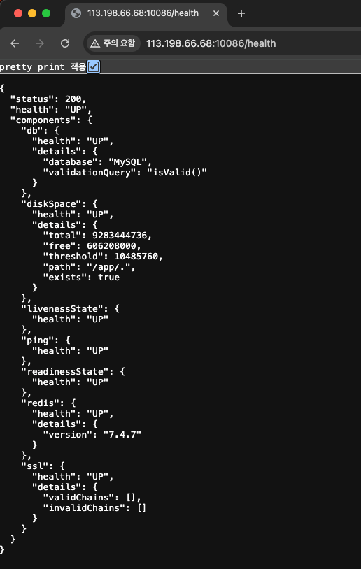

## 사용설명서
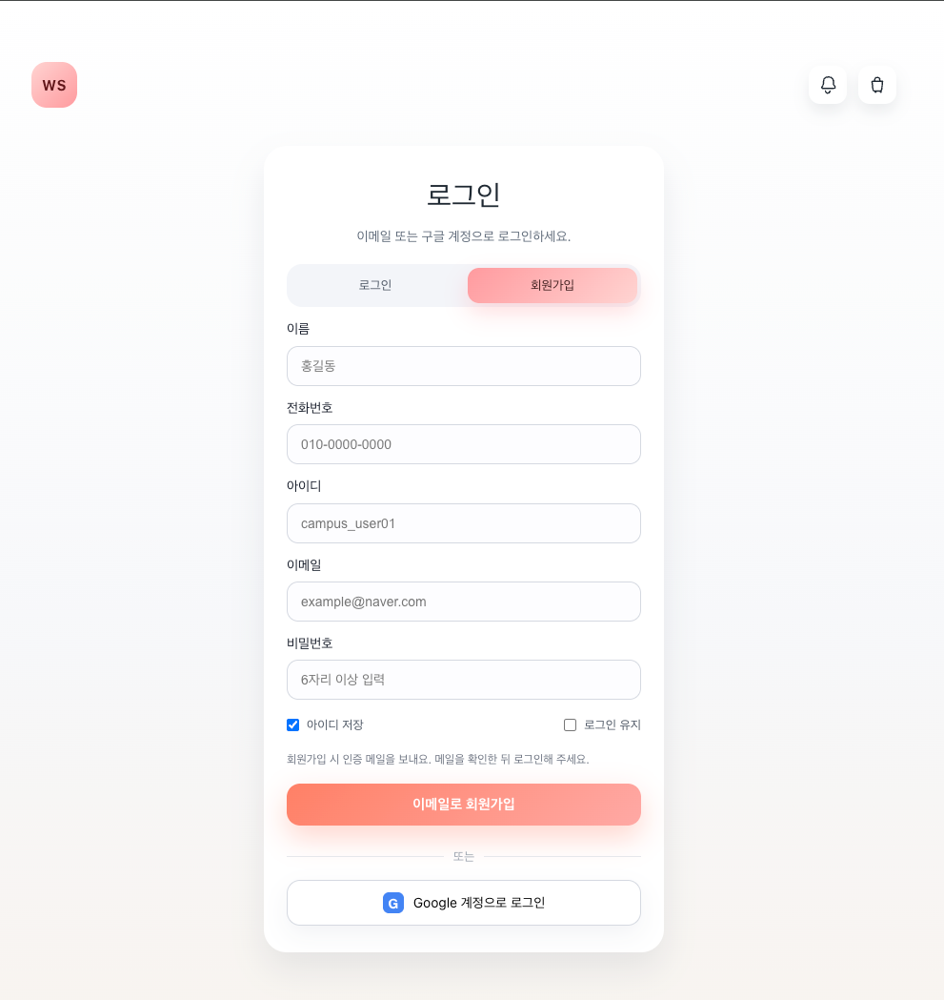
1. 회원가입 화면입니다. 이메일 혹은 구글 계정으로 회원을 만들어 로그인 할 수 있습니다.

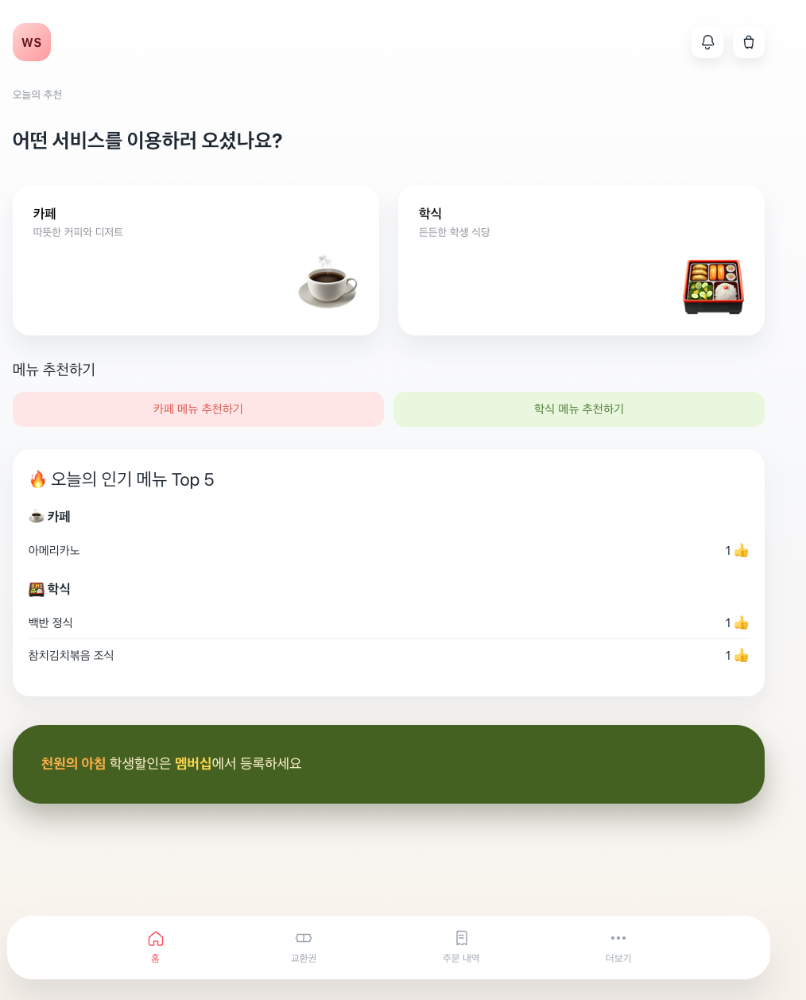
2. 홈 화면입니다.

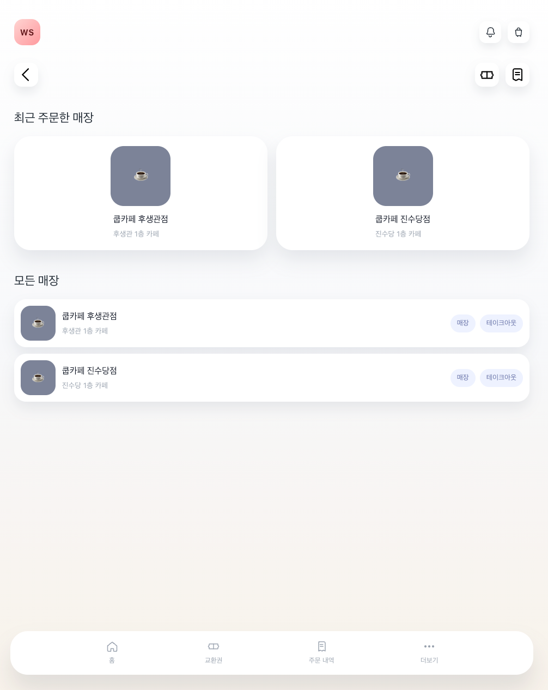
3. 매장 화면입니다. 원하는 매장을 선택 할 수 있습니다.

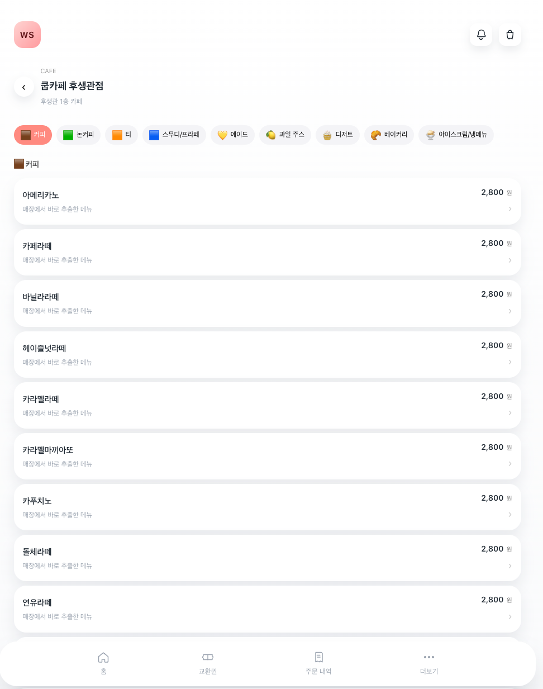
4. 메뉴 화면입니다. 다양한 메뉴를 확인 하실 수 있습니다.

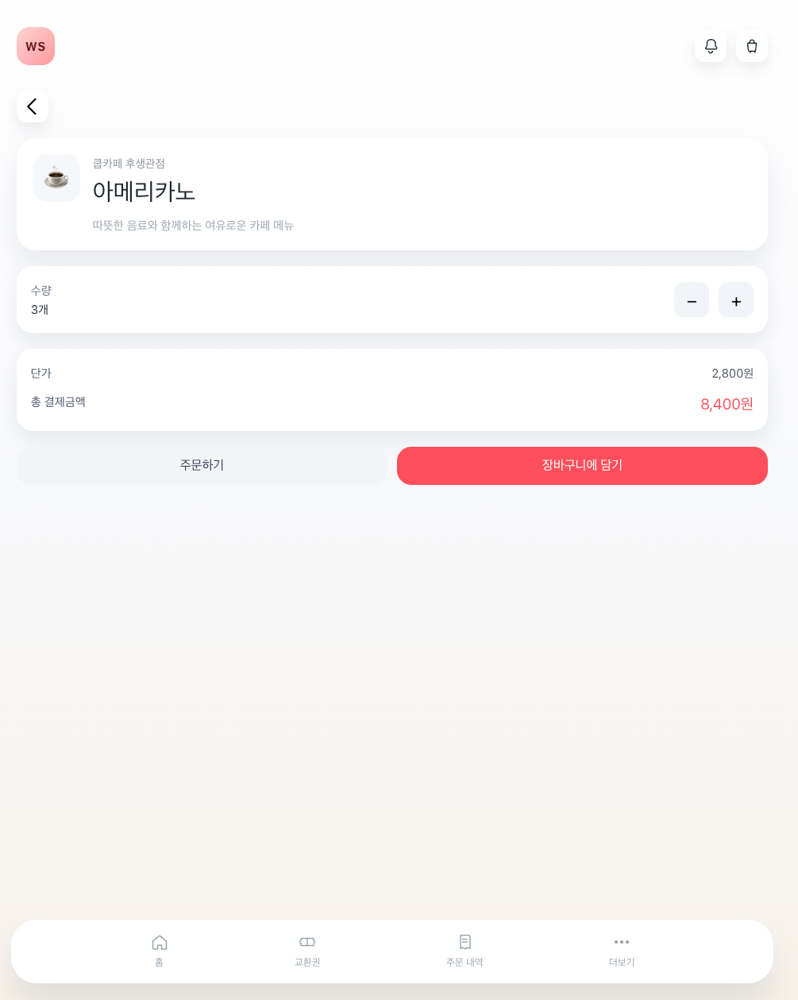
5. 메뉴 주문 화면입니다. 장바구니에 담거나 바로 주문 하실 수 있습니다.

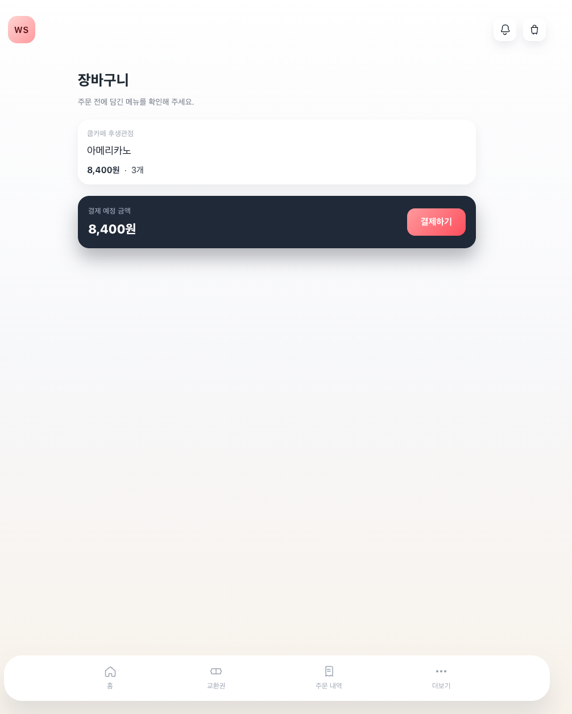
6. 장바구니 화면입니다. 화면 오른쪽 위 장바구니 모양을 통해 장바구니에 담긴 메뉴를 확인 할 수 있습니다.

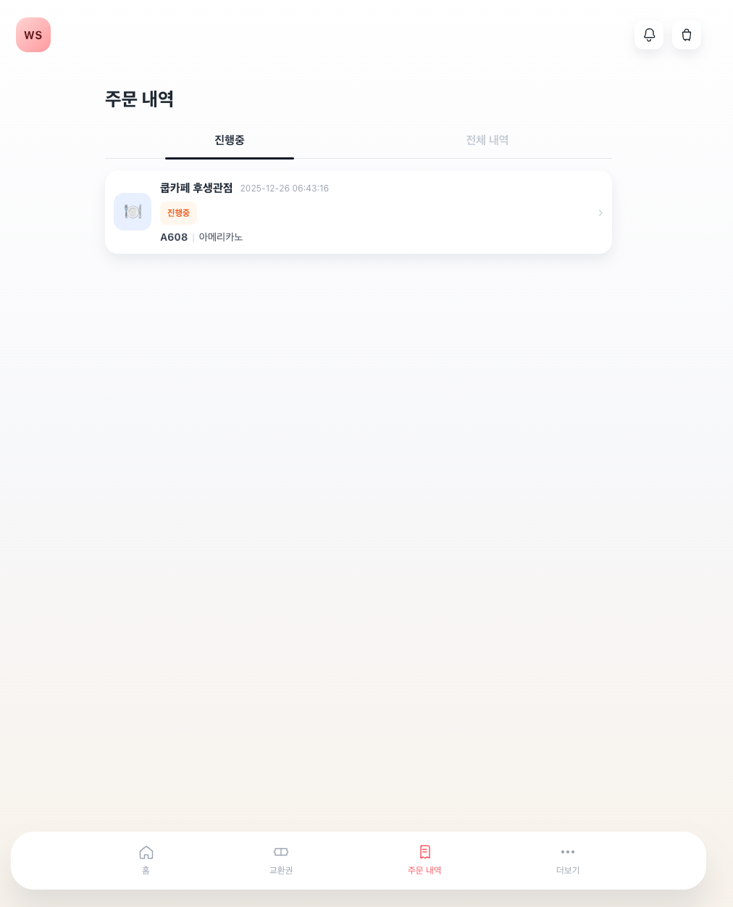
7. 주문 내역 화면입니다. 주문하신 메뉴를 확인하실 수 있습니다.

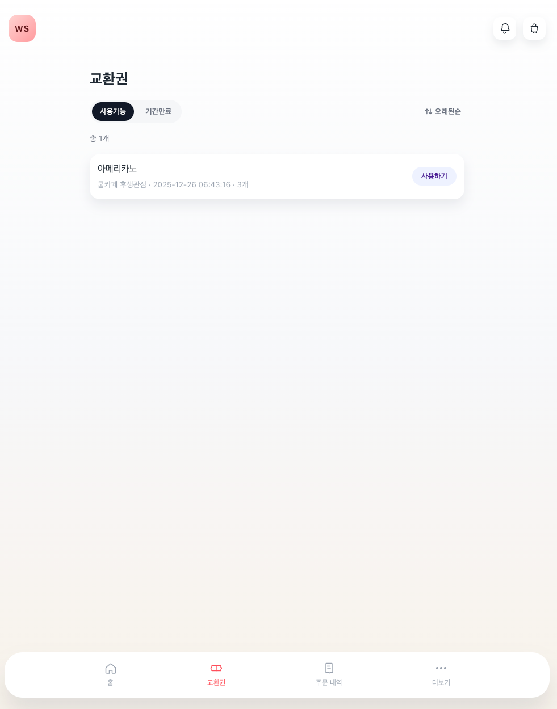
8. 교환권 메뉴입니다. 사용하기 버튼을 통해 주문 내역에 있는 메뉴를 수령 하실 수 있습니다.

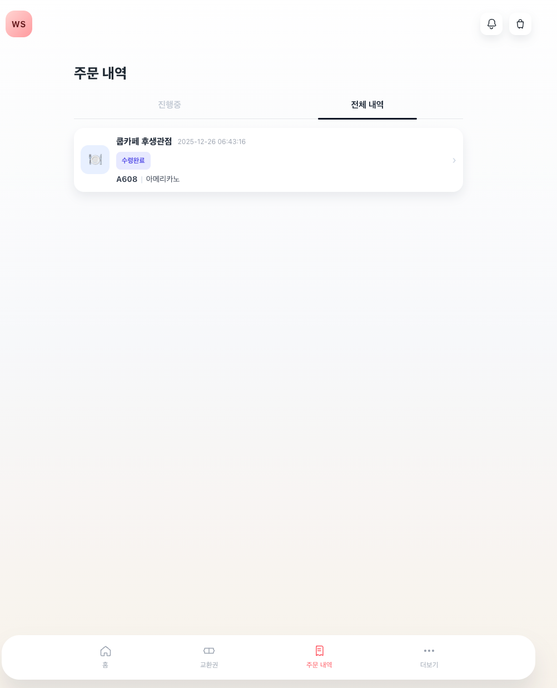
9. 교환이 완료되면 수령완료가 됩니다.

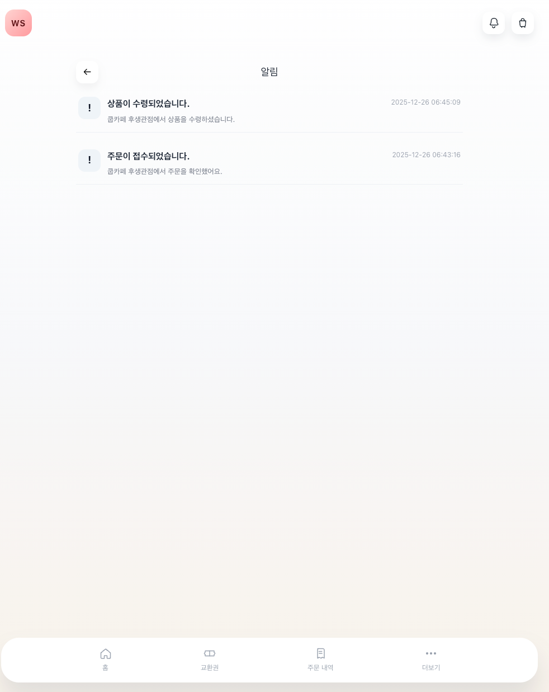
10. 알림 화면입니다. 화면 오른쪽 위 알림 버튼을 통해 다양한 알림을 확인 할 수 있습니다.

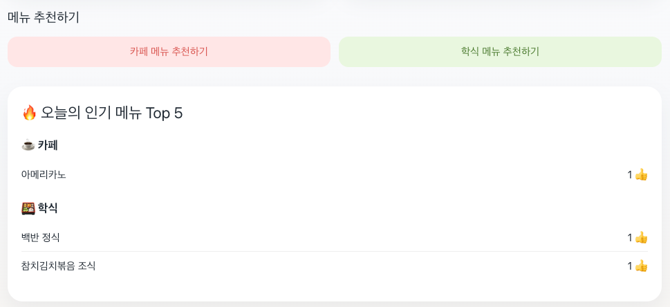
11. 홈 화면에 있는 메뉴 추천 기능입니다. 메뉴 추천하기 버튼과 오늘의 인기 메뉴를 확인 할 수 있습니다.


12. 메뉴 추천하기 화면입니다. 현재 판매중인 메뉴를 확인 할 수 있고, 검색을 통해 원하는 메뉴를 찾을 수 있습니다. 메뉴 오른쪽 엄지 버튼을 통해 추천을 할 수 있습니다.

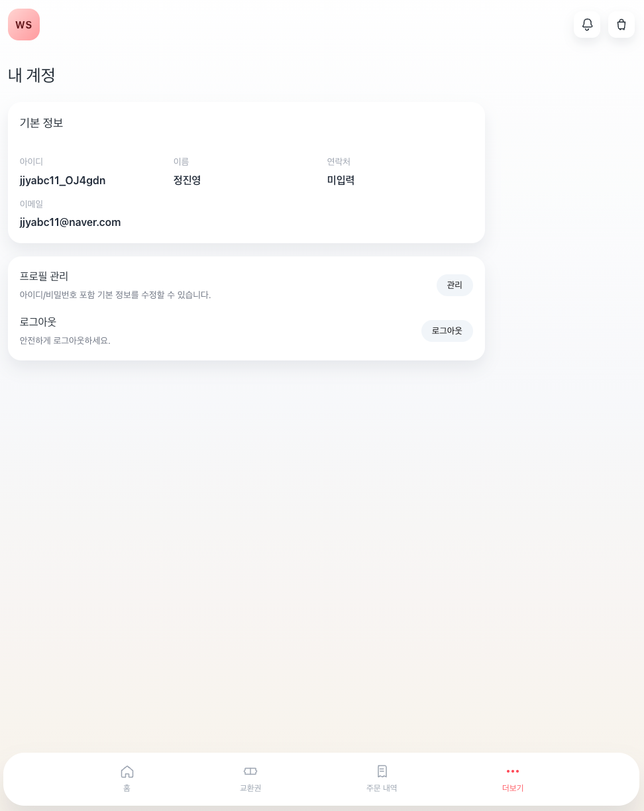
13. 더보기 화면입니다. 나의 계정 정보를 확인 할 수 있고, 프로필 관리와 로그아웃을 할 수 있습니다.

## 한계 및 개선사항
- Refresh 토큰 저장/블랙리스트가 없어 탈취 시 무효화 어려움 → DB/Redis 저장 및 로테이션, 로그아웃 시 폐기.
- JWT 시크릿/환경변수 관리 고도화 필요 → KMS/Secrets Manager 사용, 프로파일별 분리.
- 실제 결제 기능 미구현
